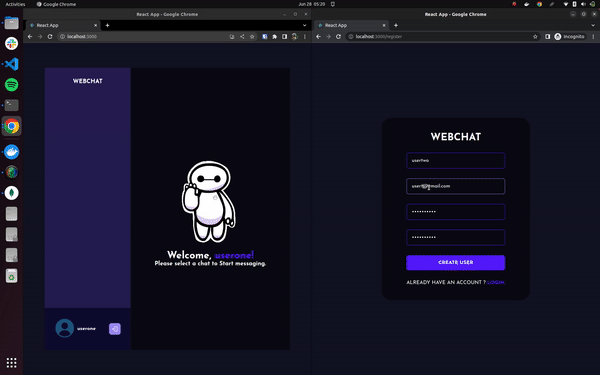

# WebChat App



This is a chat application built with React as the frontend and Python FastAPI as the backend. It allows users to communicate in real-time using a chat interface.

## Quick Start with Development Server

- To quickly run the application with the development server, run the following command:

```shell
./quick_run.sh
```

This will automatically start the backend server, install dependencies for the frontend, and start the frontend development server.

Open your web browser and navigate to `localhost:3000` to access the application.

## Installation Guide to Run Locally

Requirements

- [Node.js](https://nodejs.org/en/download)
- [MongoDB](https://www.mongodb.com/docs/manual/administration/install-community/)

Both Node.js and MongoDB should be installed on your machine. Ensure that MongoDB is running in the background.

Now install the dependencies:

```shell
cd backend_server
pip install -r requirements.txt
```

Start the backend server. Also, make sure MongoDB is running in the background

```shell
python main.py
```
Open a new terminal window:

```shell
cd ..
cd client
yarn
```
Now start the development server for the frontend:
```shell
cd client
yarn start
```

or you could also build and serve the build:

```
yarn build
yarn serve build
```

Done! Now open `localhost:3000` in your browser.

## Kubernetes Setup
1. Install Docker:

Install Docker on your machine by following the instructions for your operating system from the official [Docker website](https://docs.docker.com/get-docker/).

2. Build the React app Docker image:

Open a terminal or command prompt and navigate to the root folder of your React application (where the Dockerfile is located).

Run the following command to build the Docker image:


```shell
cd client
docker build -t react-app .
```

3. Build the Python API Docker image:

Open a terminal or command prompt and navigate to the root folder of your Python API server (where the second Dockerfile is located).

Run the following command to build the Docker image:

```shell
cd ../backend_server
docker build -t python-api .
```

4. Start Minikube:

Install Minikube by following the instructions for your operating system from the official [Minikube website](https://minikube.sigs.k8s.io/docs/start/).

Open a terminal or command prompt and start Minikube by running the following command:

```shell
minikube start
```

5. Apply the Kubernetes configuration:

Open a terminal or command prompt and navigate to the folder where you have the Kubernetes configuration files.

Run the following command to apply the deployments and services:

```shell
kubectl apply -f react-app-deployment.yaml
kubectl apply -f python-api-deployment.yaml
kubectl apply -f react-app-service.yaml
kubectl apply -f python-api-service.yaml
```

6. Access the app:

```shell
minikube service react-app --url
```
